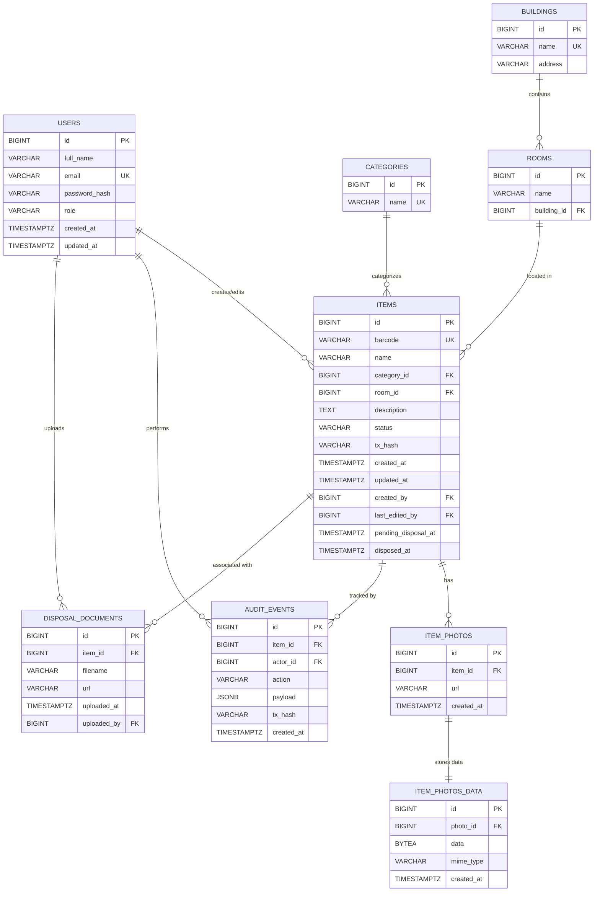

# ER Diagram - Inventory Management System Database

## Entity Relationship Diagram (Mermaid)



## Table Descriptions

### 1. users
Хранит информацию о пользователях системы.
- **id**: Первичный ключ (BIGSERIAL)
- **full_name**: Полное имя пользователя
- **email**: Уникальный email для входа
- **password_hash**: Хэш пароля
- **role**: Роль пользователя (admin, editor)
- **created_at/updated_at**: Временные метки создания и обновления

### 2. buildings
Здания, в которых расположены помещения.
- **id**: Первичный ключ (BIGSERIAL)
- **name**: Уникальное название здания
- **address**: Адрес здания

### 3. categories
Категории предметов инвентаря.
- **id**: Первичный ключ (BIGSERIAL)
- **name**: Уникальное название категории

### 4. rooms
Помещения в зданиях.
- **id**: Первичный ключ (BIGSERIAL)
- **name**: Название помещения (уникально в рамках здания)
- **building_id**: Внешний ключ на buildings

### 5. items
Основная таблица предметов инвентаря.
- **id**: Первичный ключ (BIGSERIAL)
- **barcode**: Уникальный штрихкод предмета
- **name**: Название предмета
- **category_id**: Внешний ключ на categories
- **room_id**: Внешний ключ на rooms (текущее местоположение)
- **description**: Описание предмета
- **status**: Статус (active, disposed, in_repair, pending_disposal)
- **tx_hash**: Хэш транзакции блокчейна
- **created_at/updated_at**: Временные метки
- **created_by/last_edited_by**: Внешние ключи на users
- **pending_disposal_at**: Время установки статуса pending_disposal
- **disposed_at**: Время окончательного списания

### 6. item_photos
Фотографии предметов (метаданные).
- **id**: Первичный ключ (BIGSERIAL)
- **item_id**: Внешний ключ на items (CASCADE DELETE)
- **url**: URL или путь к фото
- **created_at**: Время добавления

### 7. item_photos_data
Бинарные данные фотографий (Base64).
- **id**: Первичный ключ (BIGSERIAL)
- **photo_id**: Уникальный внешний ключ на item_photos (CASCADE DELETE)
- **data**: Бинарные данные изображения (BYTEA)
- **mime_type**: MIME-тип изображения
- **created_at**: Время добавления

### 8. audit_events
Журнал аудита всех операций с предметами.
- **id**: Первичный ключ (BIGSERIAL)
- **item_id**: Внешний ключ на items
- **actor_id**: Внешний ключ на users (кто выполнил действие)
- **action**: Тип действия (created, updated, disposed, moved, sent_to_repair, returned_from_repair, pending_disposal, disposal_finalized)
- **payload**: JSON-снимок состояния предмета
- **tx_hash**: Хэш транзакции блокчейна
- **created_at**: Время события

### 9. disposal_documents
Документы по списанию предметов.
- **id**: Первичный ключ (BIGSERIAL)
- **item_id**: Внешний ключ на items (CASCADE DELETE)
- **filename**: Имя файла документа
- **url**: URL или путь к документу
- **uploaded_at**: Время загрузки
- **uploaded_by**: Внешний ключ на users (кто загрузил)

## Отношения между таблицами

| Отношение | Тип | Описание |
|-----------|-----|----------|
| buildings → rooms | 1:N | Здание содержит много помещений |
| rooms → items | 1:N | В помещении находится много предметов |
| categories → items | 1:N | Категория включает много предметов |
| users → items | 1:N | Пользователь создаёт/редактирует предметы |
| users → audit_events | 1:N | Пользователь выполняет действия аудита |
| users → disposal_documents | 1:N | Пользователь загружает документы |
| items → item_photos | 1:N | Предмет имеет много фотографий |
| items → audit_events | 1:N | Предмет имеет историю аудит-событий |
| items → disposal_documents | 1:N | Предмет связан с документами списания |
| item_photos → item_photos_data | 1:1 | Фотография имеет бинарные данные |

## Диаграмма связей (Text-based)

```
┌─────────────┐     ┌─────────────┐
│  BUILDINGS  │────<│    ROOMS    │
└─────────────┘     └──────┬──────┘
                           │
                           ▼
┌─────────────┐     ┌─────────────┐     ┌──────────────┐
│ CATEGORIES  │────<│    ITEMS    │>────│ ITEM_PHOTOS  │
└─────────────┘     └──────┬──────┘     └──────┬───────┘
                           │                   │
                           │                   ▼
                           │           ┌──────────────┐
                           │           │ITEM_PHOTOS_DATA│
                           │           └──────────────┘
                           │
              ┌────────────┼────────────┐
              │            │            │
              ▼            ▼            ▼
      ┌───────────┐ ┌───────────┐ ┌──────────────────┐
      │   USERS   │ │AUDIT_EVENTS│ │DISPOSAL_DOCUMENTS│
      └───────────┘ └───────────┘ └──────────────────┘
```

## Статусы предметов (items.status)

- **active** — предмет активен и используется
- **in_repair** — предмет находится в ремонте
- **pending_disposal** — предмет ожидает списания
- **disposed** — предмет списан

## Типы аудит-событий (audit_events.action)

- **created** — создание предмета
- **updated** — обновление данных предмета
- **moved** — перемещение предмета
- **sent_to_repair** — отправка в ремонт
- **returned_from_repair** — возврат из ремонта
- **pending_disposal** — установка статуса ожидания списания
- **disposal_finalized** — окончательное списание
- **disposed** — устаревшее действие списания

## Роли пользователей (users.role)

- **admin** — полный доступ ко всем функциям
- **editor** — доступ к редактированию инвентаря
